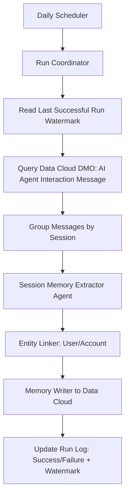
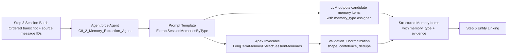

# C8.2 Daily Memory Generation Design (Autonomous Agentic Workflow)

## 1) Objective

Design an autonomous workflow that runs once per day, reads new AI interaction traces from Data Cloud, extracts memory-worthy information, links memories back to user/account when possible, and stores extracted memories in Data Cloud.

## 1.1) Purpose of Long-Term Memory

Long-term memory exists to make the agent better over time, not just within one conversation. In this design, it serves the following purposes:

- Personalization and continuity: Preserve user and account facts so future responses are context-aware and consistent.
- Task reliability: Retain successful patterns so the agent can repeat what works and reduce avoidable errors.
- Learning from experience: Capture meaningful past outcomes and interaction sequences that can guide future execution.
- Cross-session context retention: Carry important context across days and sessions instead of resetting every run.
- Explainability and auditability: Keep traceable memory records linked to source sessions/messages for review.
- Operational efficiency: Reduce repeated questioning and rediscovery by reusing verified memory signals.
- Adaptive behavior improvement: Support reflection and controlled instruction refinement based on observed outcomes.
- Governance-ready knowledge management: Store curated, scoped memory artifacts in Data Cloud with lifecycle controls.

## 2) Design Principles (Mapped to Requirements)

1. Autonomous schedule: Run as an unattended agentic workflow once every 24 hours.
2. Incremental extraction with internal run log: Process only traces newer than the last successful run watermark.
3. Memory traceability: Every memory should include user/account linkage when identifiable.
4. Data Cloud as system of record: Persist generated memories and run metadata in Data Cloud.
5. Session-level comprehension: Analyze full trace sets per session; allow multiple memory items and memory types from one session.

## 3) High-Level Architecture

## 4) Data Sources and Targets

### Source

- Data Cloud DMO: `ssot__AiAgentInteractionMessage__dlm`
- Schema source: live org describe from `sandbox-default` on 2026-08-01.

#### 4.1 Org-validated DMO schema (`ssot__AiAgentInteractionMessage__dlm`)

| API field | Type | Null | Notes for this design |
| --- | --- | --- | --- |
| `Id` | id | No | Platform record ID. |
| `ssot__AiAgentInteractionId__c` | string(15) | Yes | Interaction-level grouping key. |
| `ssot__AiAgentInteractionMessageType__c` | string(15) | Yes | Message type classifier. |
| `ssot__AiAgentInteractionMsgContentType__c` | string(15) | Yes | Content type classifier. |
| `ssot__AiAgentSessionId__c` | string(15) | Yes | Primary session grouping key. |
| `ssot__AiAgentSessionParticipantId__c` | string(15) | Yes | Participant linkage key. |
| `ssot__ContentText__c` | string(255) | Yes | Primary text payload for extraction. |
| `ssot__DataSourceId__c` | string(60) | Yes | Data source identifier. |
| `ssot__DataSourceObjectId__c` | string(60) | Yes | Source object identifier. |
| `ssot__ExternalSourceId__c` | string(15) | Yes | External source identifier. |
| `ssot__Id__c` | string(15) | Yes | Business/message ID (preferred provenance ID). |
| `ssot__IndividualId__c` | string(15) | Yes | Best direct person/individual trace key. |
| `ssot__InternalOrganizationId__c` | string(60) | Yes | Tenant/org segregation key. |
| `ssot__MessageSentTimestamp__c` | datetime | Yes | Primary watermark field (recommended). |
| `ssot__ParentMessageId__c` | string(15) | Yes | Parent-child thread relationship. |
| `ssot__SessionOwnerId__c` | string(255) | Yes | Session owner reference. |
| `ssot__SessionOwnerObject__c` | string(255) | Yes | Session owner object/type hint. |
| `ssot__rel_1744306613638_end__c` | reference | Yes | To `ssot__AiAgentSessionParticipant__dlm`. |
| `ssot__rel_1744306619512_end__c` | reference | Yes | To `ssot__Individual__dlm`. |
| `ssot__rel_1744306622350_end__c` | reference | Yes | To `ssot__AiAgentInteractionMessage__dlm` (parent message). |
| `ssot__rel_1744306624852_end__c` | reference | Yes | To `ssot__AiAgentInteraction__dlm`. |
| `ssot__rel_1744306633620_end__c` | reference | Yes | To `ssot__AiAgentSession__dlm`. |
| `Modality__c` | string(60) | Yes | Channel/modality signal. |
| `MessageStartTimestamp__c` | datetime | Yes | Optional timing boundary. |
| `MessageEndTimestamp__c` | datetime | Yes | Optional timing boundary. |
| `KQ_Id__c` | string(60) | Yes | Key qualifier attribute. |
| `KQ_AiAgentInteractionId__c` | string(60) | Yes | Key qualifier for interaction ID. |
| `KQ_AiAgentSessionId__c` | string(60) | Yes | Key qualifier for session ID. |
| `KQ_AiAgentSessionParticipantId__c` | string(60) | Yes | Key qualifier for participant ID. |
| `KQ_ParentMessageId__c` | string(60) | Yes | Key qualifier for parent ID. |
| `AttributeText__c` | string(60) | Yes | Additional message attributes. |

#### 4.2 Field mapping used by this workflow

- `message_id`: `ssot__Id__c` (fallback `Id`)
- `session_id`: `ssot__AiAgentSessionId__c`
- `interaction_id`: `ssot__AiAgentInteractionId__c`
- `timestamp_utc`: `ssot__MessageSentTimestamp__c` (fallback `MessageStartTimestamp__c`)
- `message_text`: `ssot__ContentText__c`
- `message_type`: `ssot__AiAgentInteractionMessageType__c`
- `content_type`: `ssot__AiAgentInteractionMsgContentType__c`
- `participant_id`: `ssot__AiAgentSessionParticipantId__c`
- `individual_id`: `ssot__IndividualId__c`
- `tenant_org_key`: `ssot__InternalOrganizationId__c`
- `thread_parent_id`: `ssot__ParentMessageId__c`

### Targets (Data Cloud)

- Memory Item dataset (new): Stores extracted semantic/procedural/episodic memory units.
- Run Log dataset (new): Stores each workflow run, watermark boundaries, status, and metrics.
- Optional Session Processing dataset (new): Stores session-level processing checkpoint/status for resiliency and replay.

## 5) Proposed Data Model

### A) Memory Item dataset

Suggested logical fields:

- `memory_item_id` (stable UUID)
- `memory_type` (`semantic`, `procedural`, `episodic`)
- `memory_text` (normalized memory statement)
- `memory_summary` (optional concise variant)
- `confidence_score` (0.0 to 1.0)
- `importance_score` (0.0 to 1.0)
- `session_id`
- `source_message_ids` (array/list)
- `source_time_start_utc`
- `source_time_end_utc`
- `related_user_id` (nullable)
- `related_account_id` (nullable)
- `entity_link_confidence` (0.0 to 1.0)
- `tags` (array: product, territory, intent, issue type)
- `created_at_utc`
- `run_id` (foreign key to run log)
- `dedupe_hash` (for idempotency)
- `status` (`active`, `superseded`, `retracted`)

### B) Run Log dataset

Suggested logical fields:

- `run_id` (UUID)
- `run_started_at_utc`
- `run_finished_at_utc`
- `status` (`success`, `partial_success`, `failed`)
- `watermark_from_utc` (exclusive lower bound)
- `watermark_to_utc` (inclusive upper bound)
- `sessions_discovered`
- `sessions_processed_success`
- `sessions_processed_failed`
- `messages_scanned`
- `memory_items_created`
- `memory_items_updated`
- `error_code`
- `error_summary`

### C) Optional Session Processing dataset

Suggested logical fields:

- `run_id`
- `session_id`
- `session_start_utc`
- `session_end_utc`
- `status` (`queued`, `processing`, `success`, `failed`, `skipped`)
- `attempt_count`
- `last_error`

## 6) End-to-End Workflow Design

### Step 0: Daily trigger

- Scheduler starts workflow once daily at fixed UTC time.
- A run lock is acquired to prevent overlapping runs.

### Step 1: Determine incremental window

- Read the last run with `status = success` from Run Log.
- Set:
  - `watermark_from_utc = last_success.watermark_to_utc`
  - `watermark_to_utc = current_run_start_time`
- If no previous success exists, use a bootstrap lookback window (for example, past 7 or 30 days) agreed during implementation.

### Step 2: Pull new traces

- Query `ssot__AiAgentInteractionMessage__dlm` where:
  - `ssot__MessageSentTimestamp__c > watermark_from_utc`
  - `ssot__MessageSentTimestamp__c <= watermark_to_utc`
  - `ssot__AiAgentSessionId__c != null`
  - `ssot__ContentText__c != null` (or include null content when procedural/event metadata is needed)
- Sort by `ssot__AiAgentSessionId__c`, then `ssot__MessageSentTimestamp__c`.
- Select at minimum:
  - `ssot__Id__c`, `ssot__AiAgentSessionId__c`, `ssot__AiAgentInteractionId__c`
  - `ssot__MessageSentTimestamp__c`, `MessageStartTimestamp__c`, `MessageEndTimestamp__c`
  - `ssot__ContentText__c`, `ssot__AiAgentInteractionMessageType__c`, `ssot__AiAgentInteractionMsgContentType__c`
  - `ssot__AiAgentSessionParticipantId__c`, `ssot__IndividualId__c`, `ssot__InternalOrganizationId__c`, `ssot__ParentMessageId__c`

### Step 3: Build complete session context

- Group queried messages by `session_id`.
- For each session, assemble ordered transcript and tool events.
- Enforce that extraction is done per full session found within the incremental window.

Note: If a session crosses windows (starts earlier, ends in current window), process available in-window traces plus optional backfill fetch for the same `session_id` to avoid losing context.

### Step 4: Memory extraction agent logic

For each session, extractor may output zero to many memory items across all three types.

- Semantic memory extraction:
  - Remembering facts. This involves retaining specific facts and concepts, such as user preferences or domain knowledge, so the agent can ground responses and stay personalized and relevant over time. In practice, this can be managed as a continuously updated user profile (JSON document) or as a collection of individual factual documents.
  - Examples:
    - A user prefers digital follow-up material instead of printed brochures.
    - Dr. Patel is the primary clinical decision-maker for the account.
    - The account has a standing constraint that meetings must be scheduled after 4 PM.
- Procedural memory extraction:
  - Remembering rules. This is the memory of how to perform tasks, including the agent's core instructions and behaviors. It is often represented in system prompts or refined through reflection, where the agent reviews its current instructions and recent interactions to improve its own behavior.
  - Examples:
    - When the user asks for a pre-call brief, first confirm the account, then retrieve prescriber behavior, then recommend talk points.
    - For territory insight generation, always gather the latest account signals before summarizing trends.
    - If account identification confidence is low, ask one clarification question before launching downstream tools.
- Episodic memory extraction:
  - Remembering experiences. This involves recalling past events or actions. For AI agents, episodic memory is often used to remember how to accomplish a task, and it can be implemented through few-shot example prompting so the agent learns from past successful interaction sequences.
  - Examples:
    - In a prior successful pre-call sequence, the agent confirmed the account, retrieved prescriber behavior, then generated talk points in that order.
    - During a recent territory review session, the agent identified a sudden drop in engagement for one target account.
    - In a previous session, the recommended talk track performed well because it focused on patient adherence concerns.

Extraction quality gates:

- Must be evidence-backed by one or more source message IDs.
- Must pass minimum confidence threshold.
- Must pass relevance/importance threshold.
- Must avoid sensitive or disallowed content per governance rules.

### Step 5: Entity linking (user/account)

For each candidate memory item:

- Try deterministic linking first:
  - `ssot__IndividualId__c` from message record.
  - `ssot__AiAgentSessionParticipantId__c` and session owner fields for participant context.
  - Explicit account/user references from content/tool traces (when present).
- Then probabilistic linking:
  - Name/entity matching with confidence scoring.
- Persist nullable links when unresolved; do not discard high-value memories solely for missing linkage.

Current schema finding: this DMO gives a direct path to Individual, but not a guaranteed direct Account field in the same object. Account linkage should therefore use a second-stage join/mapping strategy via related Data Cloud entities (or CRM identity resolution tables) during implementation.

### Step 6: Persist to Data Cloud with idempotency

- Compute `dedupe_hash` from normalized tuple, e.g.:
  - (`memory_type`, canonicalized memory text, `session_id`, linked entities)
- Upsert behavior:
  - New hash -> create memory item.
  - Existing hash -> refresh provenance, score, and timestamps as needed.

### Step 7: Finalize run log

- On full success:
  - Write `status = success`, metrics, and watermark boundaries.
- On partial success:
  - Write `status = partial_success` and failed session details.
  - Do not advance the official success watermark unless policy explicitly allows it.
- On failure:
  - Write `status = failed` with error summary.
  - Keep previous successful watermark unchanged.

## 7) Watermark and Recovery Strategy

- Watermark source of truth: last successful run in Run Log dataset.
- Exactly-once behavior at memory level is achieved by dedupe hash + upsert.
- At-least-once processing at message/session level is acceptable; duplicates are neutralized during persistence.
- Recovery flow:
  - Any failed/partial run can be replayed for the same window.
  - Replay is safe due to idempotent writes.

## 8) Session-Centric Memory Policy

To satisfy the requirement that extraction studies all traces from a session:

- The extractor input unit is session transcript, not individual messages.
- A single session can produce multiple memory items.
- A single session can produce items across multiple memory types.
- Every memory item keeps provenance (`source_message_ids`) for auditability.

## 9) Governance, Quality, and Safety Controls

- Data minimization: store memory statements and references, not unnecessary raw payloads.
- PII policy: classify/redact before persistence where required.
- Retention policy:
  - Episodic memories may have shorter retention.
  - Semantic/procedural memories may be longer-lived with periodic revalidation.
- Human audit mode (optional): allow sampling and review of generated memories.

## 10) Observability and KPIs

Track at least:

- Throughput: messages/session processed per run.
- Yield: memory items per 100 sessions.
- Quality: acceptance rate after confidence/importance gates.
- Linkage rate: % memories linked to user/account.
- Reliability: run success rate, replay count, mean recovery time.

## 11) Open Implementation Decisions

1. Bootstrap window for first run (7/30/90 days).
2. Confidence and importance thresholds by memory type.
3. Entity-linking precedence rules and tie-break logic.
4. Retention durations by memory type.
5. Whether partial success should advance watermark (recommended: no).

## 12) Suggested Build Sequence (After Approval)

1. Create Data Cloud datasets (Memory Item, Run Log, optional Session Processing).
2. Implement scheduler + run coordinator with lock.
3. Implement incremental query + session grouping.
4. Implement session extractor and memory typing prompts/rules.
5. Implement entity linking and idempotent upsert.
6. Add monitoring dashboard and replay command.

## 13) Agentforce Build Plan by Workflow Step

This section maps each workflow step to the concrete components to build in Agentforce.

### Step 0 (Daily trigger + run lock)

Build plan:

- Flow: `C8_2_Daily_Memory_Generation_Orchestrator` (Autolaunched Flow)
- Flow: `C8_2_Daily_Memory_Generation_Scheduler` (Scheduled path or schedule-triggered wrapper)
- Apex invocable: `LongTermMemoryAcquireRunLock` (new)
- Apex invocable: `LongTermMemoryReleaseRunLock` (new)

How it works:

- Scheduler starts `C8_2_Daily_Memory_Generation_Scheduler` once per day.
- Scheduler invokes orchestrator flow.
- First action is lock acquisition to prevent overlapping runs.

### Step 1 (Read last successful watermark)

Build plan:

- Data Cloud DLO/DMO (new): `Long_Term_Memory_Run_Log__dlm` (or equivalent Data Cloud object)
- Apex invocable: `LongTermMemoryGetLastSuccessWatermark` (new)

How it works:

- Query run log for latest `status = success`.
- Return `watermark_from_utc` and calculate `watermark_to_utc = now()`.
- If no successful run exists, return bootstrap lookback start.

### Step 2 (Fetch incremental traces from DMO)

Build plan:

- Apex service: extend `LongTermMemoryPlatformClient` (existing)
- Apex invocable: `LongTermMemoryFetchInteractionMessages` (new)

How it works:

- Query `ssot__AiAgentInteractionMessage__dlm` using:
  - `ssot__MessageSentTimestamp__c > watermark_from_utc`
  - `ssot__MessageSentTimestamp__c <= watermark_to_utc`
- Return normalized message DTOs containing IDs, timestamps, content, session, participant, and individual fields.

### Step 3 (Group traces into session transcripts)

Build plan:

- Apex service: extend `LongTermMemoryService` (existing)
- Apex invocable: `LongTermMemoryBuildSessionBatches` (new)

How it works:

- Group by `ssot__AiAgentSessionId__c`.
- Sort each session by `ssot__MessageSentTimestamp__c`.
- Produce one extraction input per session, including source message IDs.

### Step 4 (Extract semantic/procedural/episodic memories)

Build plan:

- Prompt template (new): `ExtractSessionMemoriesByType` (`genAiPromptTemplates`)
- Agent bundle (new): `C8_2_Memory_Extraction_Agent` (`aiAuthoringBundles`)
- Apex invocable: `LongTermMemoryExtractSessionMemories` (new)

Solution diagram:

How the components work together:

- The Apex invocable prepares the session payload and invokes the Agentforce agent.
- The agent applies the prompt template to analyze the full session transcript and produce candidate memories, including the `memory_type` for each item.
- The Apex class validates the response shape, normalizes outputs, and returns structured memory items for downstream entity linking and persistence; it does not decide the memory type.

How it works:

- For each session transcript, call extraction prompt/agent.
- Response schema returns a list of memory items with the LLM-assigned `memory_type` and:
  - `memory_type`
  - `memory_text`
  - `confidence_score`
  - `importance_score`
  - `source_message_ids`
- Multiple memory items and multiple memory types are allowed per session.

### Step 5 (Entity linking to user/account)

Build plan:

- Apex service: extend `LongTermMemoryContextResolver` (existing)
- Apex invocable: `LongTermMemoryResolveEntities` (new)
- Apex invocable: optional reuse/update `IdentifyAccountId` (existing)
- Data Cloud mapping object/view (new): `Individual_Account_Link__dlm` (name to finalize)

How it works:

- Deterministic user linking from `ssot__IndividualId__c` and participant/session owner keys.
- Account linking via deterministic mapping table first, then fallback heuristics.
- Persist link confidence on each memory item.

### Step 6 (Persist memories with idempotent upsert)

Build plan:

- Data Cloud DLO/DMO (new): `Long_Term_Memory_Item__dlm`
- Apex invocable: `StoreLongTermMemoryItems` (new; can extend existing `StoreTerritoryInsights` patterns)

How it works:

- Compute `dedupe_hash` from normalized memory content + type + linkage + session.
- Upsert into memory store.
- Maintain provenance (`source_message_ids`, run ID, timestamps).

### Step 7 (Finalize run result and metrics)

Build plan:

- Apex invocable: `UpdateLongTermMemoryRunStatus` (new; can align with existing `UpdateMemoryStatus` patterns)
- Optional Flow fault path: `C8_2_Daily_Memory_Generation_Orchestrator` fault connectors to write failure log.

How it works:

- Write run status and metrics to run log object.
- Advance official watermark only for full success.
- Always release lock in finalization branch.

## 14) Consolidated Component Inventory

Planned new components:

- Flows:
  - `C8_2_Daily_Memory_Generation_Scheduler`
  - `C8_2_Daily_Memory_Generation_Orchestrator`
- Agentforce assets:
  - `aiAuthoringBundles/C8_2_Memory_Extraction_Agent`
  - `genAiPromptTemplates/ExtractSessionMemoriesByType`
- Apex invocable classes:
  - `LongTermMemoryAcquireRunLock`
  - `LongTermMemoryReleaseRunLock`
  - `LongTermMemoryGetLastSuccessWatermark`
  - `LongTermMemoryFetchInteractionMessages`
  - `LongTermMemoryBuildSessionBatches`
  - `LongTermMemoryExtractSessionMemories`
  - `LongTermMemoryResolveEntities`
  - `StoreLongTermMemoryItems`
  - `UpdateLongTermMemoryRunStatus`
- Apex service classes (new or extension):
  - Extend `LongTermMemoryPlatformClient`
  - Extend `LongTermMemoryService`
  - Extend `LongTermMemoryContextResolver`
- Data Cloud objects/views:
  - `Long_Term_Memory_Item__dlm`
  - `Long_Term_Memory_Run_Log__dlm`
  - Optional `Long_Term_Memory_Session_Processing__dlm`
  - `Individual_Account_Link__dlm` (or equivalent mapping view)
- Security and access:
  - Update `Long_Term_Memory_Agent.permissionset-meta.xml`
  - Update `AFDX_Agent_Perms.permissionsetgroup-meta.xml` if needed

Planned reuse of existing components:

- `LongTermMemoryPlatformClient`
- `LongTermMemoryService`
- `LongTermMemoryContextResolver`
- `IdentifyAccountId` (if suitable for deterministic account mapping)
- `UpdateMemoryStatus` pattern for run finalization

---

This design satisfies the five stated principles while prioritizing incremental reliability, session-level understanding, and memory traceability.