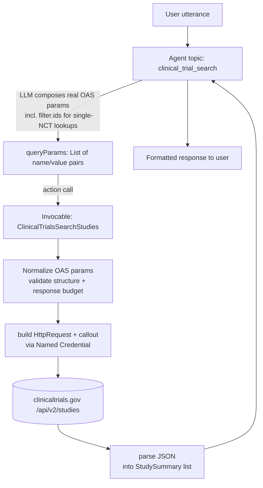

# Clinical Trials Data Agent — Design Document

## 1. Summary

An Agentforce agent that lets a user ask about clinical trials in natural language
(e.g. *"Find recruiting lung cancer trials near Boston sponsored by Pfizer"*) and have
the agent translate that request into a call against the public
[ClinicalTrials.gov REST API v2](https://clinicaltrials.gov/data-api/api), then return a
readable, cited summary of the matching studies.

The API surface is fully described by the OpenAPI spec already checked into the repo at
[config/ctg-oas-v2.yaml](../config/ctg-oas-v2.yaml). This design uses that spec as the single
source of truth for endpoints, parameters, and enums — the Apex layer and agent instructions
are generated to match it, not to duplicate it by hand.

This maps to pattern **C5 — Tool Use** in [docs/agentforce_patterns.md](agentforce_patterns.md):
the LLM decides when/how to call an external function (Apex → HTTP callout) that goes beyond
native Agentforce capability.

## 2. Goals / Non-Goals

**Goals**
- Natural-language search of studies (`GET /studies`) with the most useful filters: condition,
  intervention, sponsor, location, overall status, phase, age range.
- Natural-language lookup of a single study by NCT number, served by the *same* `/studies`
  endpoint via `filter.ids` — there is no need for a second endpoint or code path (see §3).
- Let the LLM do what it is good at — composing the actual query (including Essie expression
  syntax like `AREA[...]RANGE[...]` and boolean combinators) — instead of the app re-deriving
  NL→query logic through a hand-maintained slot table.
- Let the OAS define the complete `/studies` parameter vocabulary. Apex fixes the destination,
  normalizes serialization, validates structured values, and applies response-budget limits
  before making the request.
- Concise, cited responses (NCT ID + link) with pagination support ("show more results").
- One simple Apex class, not a class-per-concern hierarchy, for a single read-only GET
  integration this small.

**Non-goals (v1)**
- CSV / FHIR / RIS output formats — JSON only.
- `/stats/*` and `/studies/metadata` endpoints (aggregate stats, field metadata) — future
  iteration.
- Write access — the ClinicalTrials.gov API is read-only, so there is no data mutation risk.
- Authentication — the API is public/unauthenticated; no secrets are handled.

## 3. Why Salesforce Agentforce

Built as an `AgentforceServiceAgent` (same authoring model as the existing agents in
[force-app/main/default/aiAuthoringBundles](../force-app/main/default/aiAuthoringBundles)),
following the `.agent` DSL used by `C1_prompt_chaining_pre_call_recomm`. The agent's reasoning
step composes the actual ClinicalTrials.gov query — using the real OAS parameter names/enums,
not a custom slot vocabulary — because that translation (especially Essie syntax) is exactly
what an LLM is suited for. Apex does not try to re-derive that logic; it applies transport and
runtime guardrails to whatever the LLM proposes before it becomes part of an HTTP request. This "LLM
proposes, Apex disposes" split keeps prompt-injection / malformed-query risk out of the callout
layer without over-constraining what the agent can ask for (see §7 Security).

A key simplification: the OAS models a single-study lookup and a multi-study search as *the
same resource*. `GET /studies/{nctId}` is convenience sugar over `GET /studies?filter.ids=NCT...`
— both return a study (or studies) built from the same `protocolSection` modules, just with
different `fields` breadth. So this design skips the dedicated detail endpoint entirely: asking
"what's the status of NCT03540771?" is just a search with `filter.ids=NCT03540771&pageSize=1`.
That removes an entire action, an entire response shape, and the need to keep two Apex classes
in sync — one action, one endpoint, one parser, one class.

## 4. Architecture



Everything right of the agent's `queryParams` — normalization, the callout, and parsing — lives
in **one Apex class**, `ClinicalTrialsSearchStudies`. There is no separate service/client class
and no separate detail action; see §6 for why that split wasn't earning its keep here.

### 4.1 Components

| Component | Type | Purpose |
| --- | --- | --- |
| `Clinical_Trials_Data` agent | `.agent` bundle | Topic, reasoning instructions (embed the OAS parameter catalog), guardrail subagents |
| `ClinicalTrialsSearchStudies` | Apex invocable class (`Database.AllowsCallouts`) | The entire integration: normalize and validate OAS-defined query params, call `/studies`, parse the response into `StudySummary` records. Covers both multi-study search and single-NCT lookup (via `filter.ids`). |
| OAS parameter registry | Generated metadata from `config/ctg-oas-v2.yaml` (preferred) | Defines supported names, types, enums, patterns, and array serialization. It is the API contract, not a manually maintained business-slot list. |
| `ClinicalTrials_Gov_API` | Named Credential + External Credential | `https://clinicaltrials.gov/api/v2`, no auth, used instead of a hardcoded endpoint/Remote Site Setting |

### 4.2 Data flow

1. User sends a message. Agent reasoning instructions — which embed the real OAS parameter
   names, types, patterns, and enums (e.g. `query.cond`, `query.intr`, `filter.overallStatus`
   with the `Status` enum, `filter.ids`, `sort`, `fields`) — decide which parameters are
   relevant and compose their values directly, including any Essie syntax needed (e.g. combining
   condition + location with `AREA[...]`). A single NCT lookup is just `filter.ids=NCT...`.
2. Agent calls `ClinicalTrialsSearchStudies` with a generic list of `{name, value}` pairs —
   there is no fixed slot schema for the agent to conform to, and no second action to pick
   between.
3. Apex normalizes the request against the OAS parameter registry: names outside the documented
  `/studies` operation are ignored, values are checked only where the OAS declares a type,
  pattern, or enum (e.g. NCT ID regex `^[Nn][Cc][Tt]0*[1-9]\d{0,7}$` applied to each
  `filter.ids` entry), `pageSize` is capped for chat, and values are URL-encoded using the OAS
  array serialization rules. Free-form Essie expressions remain free-form. A slightly-off LLM
  guess degrades gracefully instead of hard-failing the turn.
4. The same method builds the `HttpRequest` against the Named Credential, issues the callout,
   checks the HTTP status, and parses the JSON body directly into `StudySummary` records — or
   catches timeout/5xx and returns `success = false` with a generic error message.
5. Parsing walks `studies[].protocolSection` and flattens the modules the agent needs
   (`identificationModule`, `statusModule`, `sponsorCollaboratorsModule`, `conditionsModule`,
   `designModule`) into `StudySummary` records, plus `nextPageToken`. When the caller asked for
   a single NCT ID, the result list simply has one entry.
6. Agent renders up to 10 results per turn in a compact Markdown table (title, NCT ID/link,
   status, phase, sponsor, conditions, and locations when present), with a short eligibility
   summary only when useful —
   or the single matched study when `filter.ids` was used — and offers "show more" (re-invokes
  with the stored `pageToken`). A broad request runs first with `format=json&pageSize=10`; the
  agent presents those results before offering optional refinement.

## 5. Agent Design (`.agent`)

Single topic (no multi-subagent routing needed — the search space is narrow), following the
guardrail-subagent convention already used by the pre-call agent (`escalation`, `off_topic`,
`ambiguous_question`).

```text
config:
    developer_name: "Clinical_Trials_Data_Agent"
    agent_type: "AgentforceServiceAgent"

variables:
    pageToken: mutable string = ""        # carried between search turns for "show more"
    lastQueryParamsJson: mutable string = "" # the param list the agent last sent, for follow-ups

start_agent topic_selector:
    reasoning:
        actions:
            go_to_clinical_trial_search: @utils.transition to @subagent.clinical_trial_search
            go_to_escalation: @utils.transition to @subagent.escalation
            go_to_off_topic: @utils.transition to @subagent.off_topic
            go_to_ambiguous_question: @utils.transition to @subagent.ambiguous_question

subagent clinical_trial_search:
    reasoning:
        instructions: ->
            | Translate the user's request into ClinicalTrials.gov API v2 query parameters,
              using the parameter names, types, patterns, and enums exactly as defined in
              config/ctg-oas-v2.yaml (e.g. query.cond, query.intr, query.locn, query.spons,
              filter.overallStatus, filter.ids, filter.advanced, sort, fields, pageSize). Use
              Essie expression syntax (AREA[...]RANGE[...], boolean operators) where it best
              captures the request instead of forcing everything into a single flat field. Only
              pass parameters and enum values that appear in the spec — do not invent new ones.
              If the user gives an NCT number, call search_studies with filter.ids set to that
              NCT number and pageSize=1 instead of asking for a different action. Never fabricate
              an NCT ID.
              Call search_studies with the resulting list of {name, value} pairs.
        actions:
            search_studies: @invocable.ClinicalTrialsSearchStudies
```

The agent is instructed to use the OAS's own vocabulary. It is not asked to conform to a custom
slot schema, so it is free to combine parameters however the request calls for. There is also
only one action to choose from, so the model never has to decide between a "search" tool and a
"detail" tool — one less branching decision that could go wrong.

## 6. Apex Design

### 6.1 `ClinicalTrialsSearchStudies` — one action for search, detail, and the callout

Earlier drafts split this into `ClinicalTrialsSearchStudies` + `ClinicalTrialsGetStudyDetail`
(invocable actions) + `ClinicalTrialsApiClient` (HTTP) + `ClinicalTrialsResponseParser`. On
reflection that split wasn't buying much:

- The "detail" endpoint is redundant — `filter.ids` on `/studies` already returns a single study
  by NCT ID, so there is only one endpoint to call and one response shape to parse (§3).
- There's exactly one callout in this integration. A dedicated "client" class earns its keep
  when there are multiple call sites or multiple endpoints to share plumbing across; here it was
  just an extra hop with no reuse.
- The parser has one job (flatten `protocolSection` into `StudySummary`) and is only ever used
  by this one method.

So the whole integration is one invocable Apex class. Internals are still broken into small
private methods for readability/testability, they just don't need to be separate top-level
classes:

```apex
public with sharing class ClinicalTrialsSearchStudies {
    public class Request {
      @InvocableVariable public String queryParamsJson;
    }

    public class StudySummary {
        @InvocableVariable public String nctId;
        @InvocableVariable public String briefTitle;
        @InvocableVariable public String overallStatus;
        @InvocableVariable public String phase;
        @InvocableVariable public String conditions;
        @InvocableVariable public String leadSponsor;
        @InvocableVariable public String briefSummary; // populated when fields/pageSize=1 requests more detail
    }

    public class Result {
        @InvocableVariable public List<StudySummary> studies;
        @InvocableVariable public String nextPageToken;
        @InvocableVariable public Boolean success;
        @InvocableVariable public String errorMessage;
    }

    private class ApiException extends Exception {}

    @InvocableMethod(label='Search Clinical Trials' category='Clinical Trials')
    public static List<Result> search(List<Request> requests) {
        List<Result> results = new List<Result>();
        for (Request req : requests) {
            try {
                String queryString = buildOasQueryString(req.queryParamsJson);
                HttpResponse res = callout(queryString);
                results.add(parseResponse(res));
            } catch (ApiException ex) {
                results.add(errorResult(ex.getMessage()));
            }
        }
        return results;
    }

    // normalize OAS params, enforce request limits, and URL-encode values
    private static String buildOasQueryString(String queryParamsJson) { ... }

    // build HttpRequest against callout:ClinicalTrials_Gov_API/studies, 10s timeout, one retry on timeout only
    private static HttpResponse callout(String queryString) { ... }

    // flatten studies[].protocolSection into StudySummary + nextPageToken; throws ApiException on 4xx/5xx
    private static Result parseResponse(HttpResponse res) { ... }

    private static Result errorResult(String message) { ... }
}
```

The action receives a JSON array of `{name, value}` objects because this is a stable Agentforce
invocable boundary for an arbitrary parameter collection. The parameter metadata should be
generated from `config/ctg-oas-v2.yaml` where practical. It
defines the names, types, enums, patterns, defaults, and array serialization for `/studies`.
This avoids maintaining a second hand-written list that can drift from the API specification.
The Apex class may still apply local policy after metadata validation, such as capping `pageSize`
or limiting total request length for chat.

If this integration grows meaningfully (e.g. a second external API, or reuse of the HTTP/parsing
logic from another agent), splitting `callout()`/`parseResponse()` back out into their own
classes is a cheap, mechanical refactor at that point — there's no need to pre-build that
separation before it's earned.

### 6.2 Runtime guardrails around the OAS contract

The LLM is free to decide which documented parameters to send and how to phrase their values.
Apex does not translate the user's intent or restrict legitimate Essie searches. It only applies
the following runtime guardrails:

| OAS parameter name | Validation rule | On failure |
| --- | --- | --- |
| Any documented `/studies` parameter | Validate according to generated OAS metadata; preserve free-form Essie values and URL-encode them | return a validation message or omit only the invalid value |
| `filter.ids` | Each comma/pipe-separated entry must match `^[Nn][Cc][Tt]0*[1-9]\d{0,7}$` | ask the agent to confirm the ID; do not call with an invalid ID |
| `filter.overallStatus` | Each value must be a member of the OAS `Status` enum | omit invalid enum values and retain valid ones |
| `filter.geo` | Must match the OAS distance pattern | omit the invalid value |
| `sort` / `fields` | Validate item patterns and OAS item limits | omit invalid items |
| `pageSize` | Clamp to `1..10` for chat, regardless of the API's larger maximum | clamp, never reject |
| `countTotal` | Disable by default because it can require counting all matches; enable only when the product explicitly supports it | omit or force `false` |
| `format` | Force `json`; v1 does not stream CSV or archive responses into chat | force `json` |
| Unknown parameter name | Not part of the OAS `/studies` operation | ignore it; it is not a supported API capability |

The OAS is the contract between the agent and the API. The runtime guardrails are a thin
application policy layer around that contract, not a manually curated list of which clinical
trial questions are allowed.

## 7. Security Considerations (OWASP-relevant)

- **Injection**: the LLM composes documented parameter names/values freely, but Apex fixes the
  Named Credential and `/studies` path, URL-encodes values, and validates structured fields
  server-side. A crafted user message cannot change the destination or method. Unknown names are
  ignored because they are outside the OAS operation, not because the agent has a narrow business
  vocabulary.
- **SSRF**: endpoint is fixed via Named Credential (`https://clinicaltrials.gov/api/v2`); no
  user input is ever used to build the host/scheme, only query parameters.
- **Data exposure**: ClinicalTrials.gov data is public; no Salesforce org data is sent to the
  external API and no external response data is persisted by default (v1 is read/summarize
  only).
- **Error handling**: raw HTTP error bodies from the external API are logged (`System.debug`)
  but never echoed verbatim to the chat user, avoiding leakage of internal details.
- **Sharing**: invocable classes are `with sharing`; no Salesforce record access is required for
  this agent, so no elevation of privilege risk.
- **DoS / cost control**: `pageSize` is hard-capped server-side; the agent does not allow
  unbounded pagination loops (max one "show more" continuation per user turn).

## 8. Error & Empty-State Handling

| Condition | Behavior |
| --- | --- |
| 0 studies match | Agent tells the user no matches were found and suggests broadening the search (drop a filter). |
| Invalid/unresolvable NCT ID | Agent asks the user to confirm the NCT number; an invalid `filter.ids` entry is dropped server-side rather than sent to the callout. |
| API timeout / 5xx | Agent apologizes and suggests retrying shortly; no stack trace or raw error surfaced. |
| More than 10 results | Agent shows first page (≤10) and offers "show more" using `nextPageToken`. |

## 9. Testing Plan

- Apex unit tests using `HttpCalloutMock` covering: OAS metadata normalization, structured-value
  validation, unknown parameter names ignored, response-budget limits, realistic LLM-style param
  combinations, single-NCT lookup via `filter.ids`, empty result set, 400/404/500 responses,
  timeout, and pagination (`nextPageToken` round-trip).
  search with realistic LLM-style param combinations, empty result set, 400/404/500 responses,
  timeout, NCT ID validation rejection, pagination (`nextPageToken` round-trip).
- Agent-level manual test script (recorded in this doc's follow-up PR) covering the sample
  utterances in §10.
- Target ≥90% Apex coverage on the new classes per standard Salesforce deployment gate.

## 10. Sample Utterances

- "Are there any recruiting trials for lung cancer near Boston?"
- "Show me trials sponsored by Pfizer for rheumatoid arthritis."
- "What's the status of NCT03540771?"
- "Any completed trials studying metformin for type 2 diabetes?"

## 11. Rollout Plan

1. **Phase 1 (this doc)** — design review and sign-off.
2. **Phase 2** — implement Named Credential, Apex classes + tests.
3. **Phase 3** — implement `.agent` bundle, permission set (`Clinical_Trials_Data_Agent` –
   mirrors the `Territory_Insights_Agent.permissionset-meta.xml` pattern), wire into
   `AFDX_Agent_Perms` permission set group.
4. **Phase 4** — manual conversation testing, then deploy to scratch org for review.

## 12. Open Questions

- Should study-detail results be cached (e.g. a lightweight custom object) to avoid repeat
  callouts for popular NCT IDs within a session? Deferred to a later iteration.
- Do we need multi-locale support for the agent instructions (project currently defaults to
  `en_US` only, per existing agents)?
