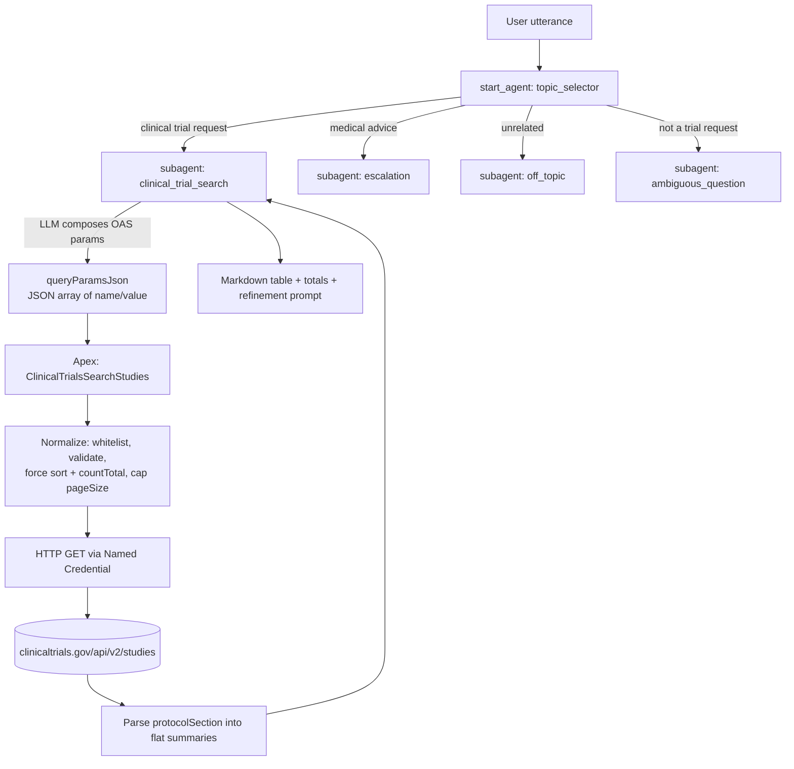

# Clinical Trials Data Agent — Design Document (As Built)

**Status:** Deployed and active
**Document type:** Retrospective — describes the system as actually built and deployed, not as originally proposed
**Last verified:** 2026-09-11
**Target org:** `lsc-default` (`admin@glsdo-2609.demo`, org id `00Daj000016gInpEAE`), API v67.0

---

## 1. Summary

An Agentforce service agent that answers natural-language questions about clinical trials — *"Find recruiting phase 3 lung cancer trials sponsored by Pfizer near Boston"* — by translating the request into a [ClinicalTrials.gov REST API v2](https://clinicaltrials.gov/data-api/api) `/studies` query, calling it through Apex, and rendering the returned studies as a cited summary.

The OpenAPI spec at [config/ctg-oas-v2.yaml](../config/ctg-oas-v2.yaml) is the source of truth for the parameter vocabulary. The agent's reasoning instructions and the Apex whitelist are both derived from it.

The system is read-only. It holds no secrets, writes no data, and calls a public unauthenticated endpoint.

---

## 2. Pattern classification

Against [docs/agentforce_patterns.md](agentforce_patterns.md):

| Pattern | Use here |
|---|---|
| **C5 — Tool Use** | Primary pattern. The LLM decides how to compose an external API call that is beyond native LLM capability, and invokes it via Apex. |
| **C2 — Routing** | `topic_selector` routes between the search subagent and three guardrail subagents. |
| **C8.1 — Short-term memory** | Three agent variables carry the previous query and page token across turns to support "show more". |

---

## 3. Architecture



**Design split — "LLM proposes, Apex disposes."** The LLM composes the query, including Essie expression syntax, because that translation is what an LLM is genuinely good at. Apex does not re-derive natural-language intent; it applies transport and safety guardrails to whatever the LLM proposes before it becomes an HTTP request. This keeps malformed-query and prompt-injection risk out of the callout layer without constraining expressiveness through a hand-maintained slot table.

**One endpoint, not two.** The OAS models single-study lookup and multi-study search as the same resource: `GET /studies/{nctId}` is sugar over `GET /studies?filter.ids=NCT...`. The design skips the detail endpoint entirely — *"What is NCT03540771 about?"* is a search with `filter.ids` and `pageSize=1`. That removes an action, a response shape, and a second Apex class.

---

## 4. Component inventory

| Component | Type | Path |
|---|---|---|
| `Clinical_Trials_Data_Agent` | AiAuthoringBundle (145 lines) | [.agent](../force-app/main/default/aiAuthoringBundles/Clinical_Trials_Data_Agent/Clinical_Trials_Data_Agent.agent) |
| `ClinicalTrialsSearchStudies` | ApexClass (485 lines) | [.cls](../force-app/main/default/classes/ClinicalTrialsSearchStudies.cls) |
| `ClinicalTrialsSearchStudiesTest` | ApexClass (162 lines) | [.cls](../force-app/main/default/classes/ClinicalTrialsSearchStudiesTest.cls) |
| `ClinicalTrials_Gov_API` | NamedCredential | [.xml](../force-app/main/default/namedCredentials/ClinicalTrials_Gov_API.namedCredential-meta.xml) |
| `Clinical_Trials_Data_Agent` | PermissionSet | [.xml](../force-app/main/default/permissionsets/Clinical_Trials_Data_Agent.permissionset-meta.xml) |
| `AFDX_Agent_Perms`, `AFDX_User_Perms` | PermissionSetGroup | [permissionsetgroups/](../force-app/main/default/permissionsetgroups/) |
| `Clinical_Trials_Data_Agent` | Bot + BotVersion v1 | [bots/](../force-app/main/default/bots/) — *generated by publish* |
| `Clinical_Trials_Data_Agent_v1` | GenAiPlannerBundle | [genAiPlannerBundles/](../force-app/main/default/genAiPlannerBundles/) — *generated by publish* |

The `bots/` and `genAiPlannerBundles/` directories are **generated by `sf agent publish`**, not hand-authored. The `.agent` bundle is the editable source.

### Agent structure

- **`topic_selector`** (start agent) — routes to one of four subagents.
- **`clinical_trial_search`** — the working subagent. Owns the `search_studies` action and the NL→API translation contract (§5).
- **`escalation`** — declines medical advice, refers to a healthcare professional.
- **`off_topic`** — redirects non-trial requests.
- **`ambiguous_question`** — used *only* when the message is not a trial request at all. Explicitly must not be used for merely underspecified searches.

### Variables (short-term memory)

| Variable | Purpose |
|---|---|
| `pageToken` | `nextPageToken` from the last response, for "show more" |
| `lastQueryParamsJson` | Parameters used in the previous search, replayed on paging |
| `lastStudiesJson` | Study summaries from the previous search |

---

## 5. The NL → API translation contract

This is the core of the agent. The `clinical_trial_search` reasoning instructions (14,339 characters) encode the following contract.

### 5.1 Input shape

A JSON array of `{"name": "<exact OAS parameter name>", "value": "<string>"}`. Every value is a JSON string, including numbers. Multiple values for one parameter are pipe-separated. Names outside the Apex whitelist are silently discarded, so the instruction enumerates the legal names explicitly.

### 5.2 Text search parameters

Mapped to the narrowest fitting field: `query.cond` (disease), `query.intr` (treatment/drug/device), `query.spons` (sponsor or collaborator), `query.lead` (lead sponsor only, when explicit), `query.locn` (place as plain text), `query.titles` (title/acronym), `query.outc` (outcome measure), `query.id` (non-NCT identifiers), `query.patient` (user describes a person), `query.term` (everything else). All accept Essie syntax — quoted phrases, `AND`/`OR`/`NOT`, parentheses.

### 5.3 Status

`filter.overallStatus`, pipe-separated, restricted to the **10** values Apex accepts. Natural phrasings are mapped explicitly (*"open"*, *"accepting patients"* → `RECRUITING|ENROLLING_BY_INVITATION`; *"stopped"* → `TERMINATED|WITHDRAWN|SUSPENDED`).

### 5.4 `filter.advanced` — the escape hatch

Everything with no dedicated parameter — phase, age, sex, study type, enrollment size, dates, funder class, randomization, masking, results availability — is expressed as `AREA[FieldName]value` terms joined with `AND`/`OR`/`NOT`. This is what lifts coverage from five concepts to the full API surface.

The instruction enumerates verified field names in three groups: enum fields (Phase, StudyType, StdAge, Sex, HasResults, LeadSponsorClass, InterventionType, DesignPrimaryPurpose, DesignAllocation, DesignMasking, …), date/number fields taking `RANGE[from,to]`, and text fields. A phrase table maps common utterances (*"phase 3"*, *"pediatric"*, *"double blind"*, *"industry funded"*, *"large trials"*) to concrete expressions.

### 5.5 Precedence rule — resolving the `query.*` / `AREA[]` overlap

Several concepts are reachable both ways. The two paths return **materially different** result sets, so leaving the choice open is a correctness bug, not a style question:

| Concept | `query.*` | `AREA[]` | Divergence |
|---|---|---|---|
| outcome "overall survival" | 44,861 | 6,722 | **6.67×** |
| intervention "aspirin" | 2,181 | 1,204 | 1.81× |
| sponsor "Pfizer" | 6,080 | 3,874 | 1.57× |
| title "stroke" | 8,141 | 7,296 | 1.12× |
| condition "asthma" | 5,279 | 4,946 | 1.07× |
| country "Japan" | 9,847 | 9,319 | 1.06× |

**Rule as built:** always prefer the `query.*` parameter — it expands synonyms and related terms, while `AREA[]` matches one field literally. Drop to `AREA[]` for that concept only when the user needs strict exclusion or cross-field boolean logic a single `query.*` value cannot express (*"in France or Spain but not Germany"*). Never express the same concept in both.

### 5.6 Dates

All relative time expressions resolve against **today's date at run time**, never a date baked into the instructions, and always emit a full `YYYY-MM-DD` bound. A bare year (`AREA[StartDate]2022`) is used only when the user names exactly one year with no direction.

### 5.7 Failure handling

An invalid `AREA` field name returns HTTP 400, which Apex maps to a "no matches" result — so a hallucinated field name is **indistinguishable from a legitimate empty result**. The instruction therefore forbids inventing AREA names and requires falling back to `query.term`. On zero results the agent states the applied filters and may retry once with the most restrictive constraint dropped, disclosing that it broadened the search.

---

## 6. Apex guardrails

`ClinicalTrialsSearchStudies` is a single class — one action, one endpoint, one parser — with no service/client hierarchy, which is proportionate for a read-only GET.

| Guardrail | Behaviour | Rationale |
|---|---|---|
| Parameter whitelist | **29** names from the OAS; anything else dropped | Fixes the API surface regardless of what the LLM proposes |
| `pageSize` | Clamped to 1–**10** | Response budget; prevents oversized payloads |
| `sort` | **Always forced** to `LastUpdateSubmitDate:desc` | Deterministic, freshness-ordered results |
| `countTotal` | **Always forced** to `true` | Guarantees `totalCount` for the summary line |
| `format` | Coerced to `json` | CSV path is out of scope |
| `filter.ids` | Regex-validated NCT pattern, pipe-joined | Blocks malformed or fabricated IDs |
| `filter.geo` | Regex-validated `distance(lat,lon,radius)` | Rejects malformed geo functions |
| `filter.overallStatus` | Restricted to **10** known values | Invalid statuses dropped rather than passed through |
| `fields` | Pattern-validated; **`NCTId` always appended** | Every displayed study stays identifiable |
| Value length | Capped at 4,000 chars | Prevents oversized query strings |
| Errors | 400/404 → "no matches"; other → generic unavailable message | No internal detail leaks to the user |
| Timeout | 10s | Bounded callout |

### Action I/O

**Input:** `queryParamsJson` (string, optional).
**Outputs:** `studiesJson`, `nextPageToken`, `success`, `errorMessage`, `appliedQueryJson`, `returnedStudyCount`, `totalCount`.

`appliedQueryJson` returns the **normalized parameters actually sent**. The agent is instructed not to claim a filter was applied unless it appears there — this closes the gap between what the LLM asked for and what Apex actually transmitted.

Each study summary is flattened from `protocolSection` into: `nctId`, `studyUrl`, `briefTitle`, `overallStatus`, `phase`, `studyType`, `conditions`, `leadSponsor`, `locations` (max 3), `briefSummary`, `hasResults`, `startDate`, `primaryCompletionDate`, `completionDate`, `studyFirstPostDate`, `lastUpdatePostDate`.

---

## 7. Response rendering rules

- Lead with one sentence stating applied filters and result count; then the table; then at most one refinement question.
- Always report `totalCount`, not just the page count, and flag when more results exist.
- Always surface start date and completion date (or primary completion date as fallback); omit empty dates rather than inventing them.
- Condense any attribute over 128 words while preserving key points.
- Multiple studies render as one Markdown table row each; empty fields omitted, never fabricated.
- **Never** emit "loading", "pending", or "unavailable" language when `success=true` and studies were returned — render records immediately.
- Because `sort` is forced, results are described as **most recently updated**, never as "best" or "most relevant" matches.
- No medical advice; no implication that a study suits a particular patient.

---

## 8. Verification

| Check | Result |
|---|---|
| OAS parameter names vs Apex whitelist | 29 names reconciled |
| `AREA[]` field names probed against live API | 40+ confirmed valid; invalid name returns HTTP 400 |
| `aggFilters` facet ids probed | Valid, but **deliberately not adopted** — see §9 |
| Query shapes executed end-to-end against live API | 18/18 returned HTTP 200 with non-empty results |
| Apex unit tests | **5/5 pass** |
| Live callout through deployed Apex | `success=true`, `totalCount=212`, 3 studies; forced `sort` + `countTotal` confirmed in `appliedQueryJson` |
| `sf agent validate authoring-bundle` | **0 errors** — also confirms the 14,339-char instruction block is within platform limits |

Test methods: `searchesWithOasParametersAndBuildsSummary`, `forcesLastUpdateSubmitDateDescendingSort`, `filtersInvalidStructuredValuesAndForcesJson`, `alwaysRequestsNctIdWhenFieldsAreRestricted`, `returnsSafeErrorForServiceFailure`.

**Not yet verified:** no agent utterance tests have been run. Everything above validates that the *target API calls* are well-formed and that the *plumbing* works. It does **not** prove that the LLM, reading these instructions under the Agentforce runtime, reliably produces those calls. That requires `sf agent preview` or `sf agent test` against real utterances and is the main open gap.

---

## 9. Decisions and trade-offs

**`filter.advanced` chosen over `aggFilters`.** Both are whitelisted in Apex and both work. `filter.advanced` is taught exclusively because an invalid `AREA` name fails loudly with HTTP 400, whereas an invalid `aggFilters` key (e.g. `phase:9`) returns **HTTP 200 with zero results** — silently wrong, and indistinguishable from a genuine empty set. Loud failure is preferable when an LLM is generating the value.

**Forced sort over relevance ranking.** `LastUpdateSubmitDate:desc` gives deterministic, reproducible output. The cost is that `query.*` relevance ranking is inert, so the breadth of `query.*` (§5.5) — not its ranking — is the reason to prefer it.

**`pageSize` capped at 10.** Bounds the response for LLM context. The agent must not promise more per page.

**Statuses reduced from 14 to 10.** Apex omits `NO_LONGER_AVAILABLE`, `TEMPORARILY_NOT_AVAILABLE`, `APPROVED_FOR_MARKETING`, and `WITHHELD`. These are expanded-access/edge states; the instruction lists only the 10 so the agent never emits a value that would be silently stripped.

**`postFilter.*` whitelisted but unused.** With no aggregation in play they are equivalent to `filter.*`; the instruction forbids them to avoid two ways of saying one thing.

---

## 10. Known limitations

1. **No utterance-level testing** (§8) — the largest open gap.
2. **Invalid AREA names are masked** as "no matches" rather than surfacing as errors, because Apex maps 400 → no-match. Mitigated by instruction, not enforced by code.
3. **10 results per page maximum**, regardless of what the user asks for.
4. **No relevance ranking** — freshness ordering only.
5. **Instruction length (14,339 chars)** validates today, but the phrase table is the compressible part if a future platform limit bites.
6. **Out of scope:** CSV/FHIR output, `/stats/*` and `/studies/metadata` endpoints, `markupFormat`, `geoDecay`, `filter.synonyms`.
7. **`filter.geo` depends on the LLM knowing coordinates.** Instruction falls back to `query.locn` when unsure, but a confidently wrong coordinate would search the wrong place.

---

## 11. Deployment runbook

The sequence that actually works. **Metadata deployment alone does not produce a running agent** — this was the main deployment surprise.

```bash
# 1. Create the agent user FIRST — the .agent file references it by username
sf data create record --target-org <org> --sobject User \
  --values "FirstName='Clinical Trials' LastName='Data Agent' Alias='ctdagent' \
            Username='clinical.trials.agent@<org-suffix>' Email='...' \
            CommunityNickname='ctdagent2609' ProfileId=<Einstein Agent User profile id> \
            TimeZoneSidKey='America/Los_Angeles' LocaleSidKey='en_US' \
            EmailEncodingKey='UTF-8' LanguageLocaleKey='en_US'"

# 2. Point the bundle at that user
#    access: default_agent_user: "clinical.trials.agent@<org-suffix>"

# 3. Validate before deploying
sf project deploy start --target-org <org> --dry-run

# 4. Deploy metadata (7 components)
sf project deploy start --target-org <org>

# 5. Assign permission sets to the agent user
#    Clinical_Trials_Data_Agent, force__AgentforceServiceAgentBase,
#    force__AgentforceServiceAgentUser, force__EinsteinGPTPromptTemplateUser

# 6. Publish — turns the authoring bundle into a runtime Bot + planner
sf agent publish authoring-bundle --target-org <org> --api-name Clinical_Trials_Data_Agent

# 7. Activate — publish leaves the version Inactive
sf agent activate --target-org <org> --api-name Clinical_Trials_Data_Agent
```

### Deployment notes

- **Steps 6–7 are mandatory.** After step 4, `BotDefinition` was still empty. After step 6, `BotVersion` existed but was `Inactive`.
- **Agent user must exist before the bundle deploys.** The placeholder `your-safe-placeholder@your-org.example.com` passed dry-run validation, which means a bad username will *not* fail the deploy — it fails later at runtime.
- **`AFDX_Agent_Perms` referenced a nonexistent `Resort_Agent` permission set**, which failed the deploy with *"permission set names are invalid"*. The reference was removed.
- Publish writes `bots/` and `genAiPlannerBundles/` into the source tree; commit them.

### As-deployed state

| Item | Value |
|---|---|
| Agent user | `clinical.trials.agent@glsdo-2609.demo` (`005aj00000dnRLbAAM`) |
| Profile / licence | Einstein Agent User / Einstein Agent |
| BotDefinition | `0Xxaj000004E2vhCAC`, type `ExternalCopilot` |
| BotVersion | v1 — **Active** |
| Planner | `Clinical_Trials_Data_Agent_v1` |
| Named credential endpoint | `https://clinicaltrials.gov/api/v2`, `NoAuthentication`, `Anonymous` |

---

## 12. Change history

| Date | Change |
|---|---|
| 2026-08-22 | Initial agent, Apex action, key dates in output; forced `sort=LastUpdateSubmitDate:desc` |
| 2026-08-31 | Added `totalCount` to the action output |
| 2026-09-10 | Instruction rewrite: full parameter vocabulary, `filter.advanced` AREA catalogue, precedence rule, date resolution. Agent user created; deployed, published and activated to `lsc-default` |
| 2026-09-11 | Legacy design document removed; this retrospective document written |

---

## 13. Next steps

1. **Run utterance tests** (`sf agent preview` / `sf agent test`) to close the §8 gap — the only way to confirm the translation contract holds at runtime.
2. Consider surfacing API 400s distinctly from genuine empty results, so a malformed `AREA` expression is diagnosable.
3. Review `topic_selector` routing for constraint-heavy prompts (*"phase 3 trials in Japan"*) that could be misrouted to `ambiguous_question`.
